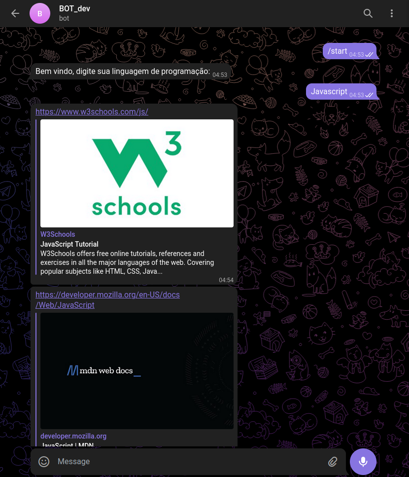
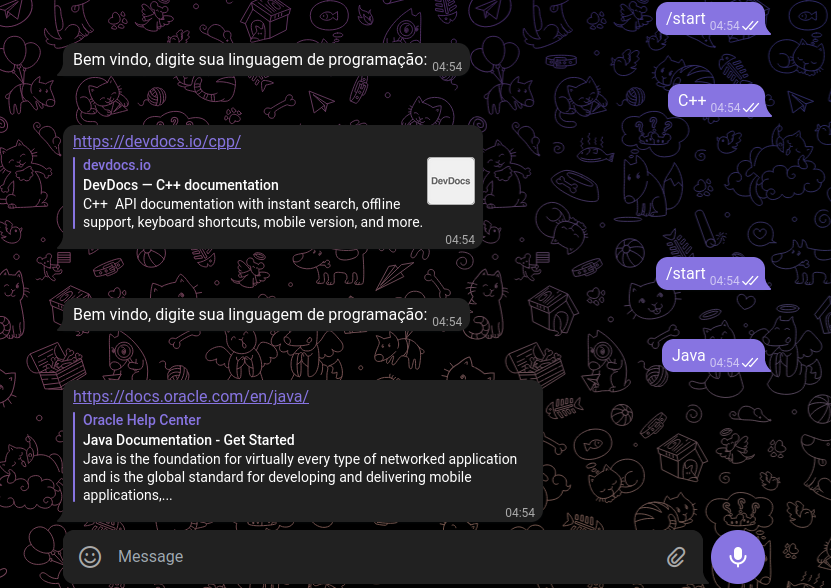

## Bot to show programming language documentation

``Has two backends, it's possible has a frontend in future ``
``1- botTelegraft.js For running API Telegram and consumer api Server.js``
``2- Backend Server.js For running data for show in botTelegraft and consumers``

> npm install - for install all dependencies
> nodemon server.js - for running server
>> nodemon botTelegraft.js - for running server Telegram it's make bot work.
to install all dependencies of this project dependency package (package.json)

## Languages support in moment

|   1 |  2    | 
| ---------  |:----:|
| JS | PHP  |
| C#         | Ruby |
| Java       | C    |
| C++        | Go   | 

